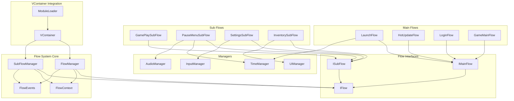
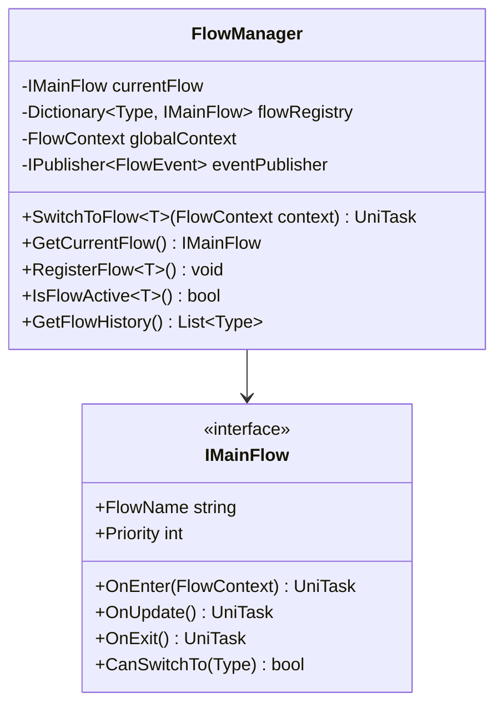
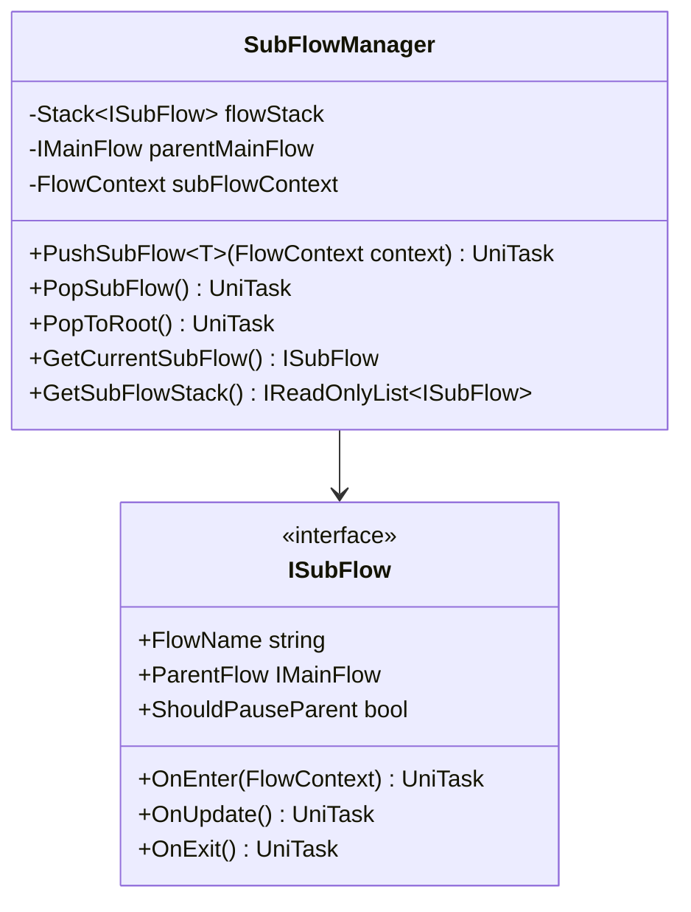
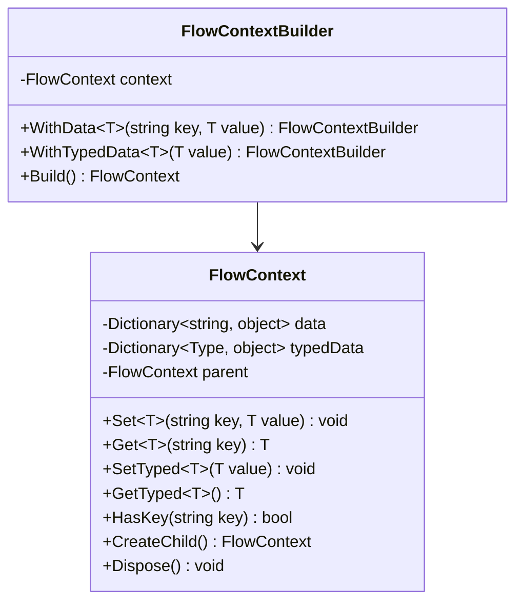
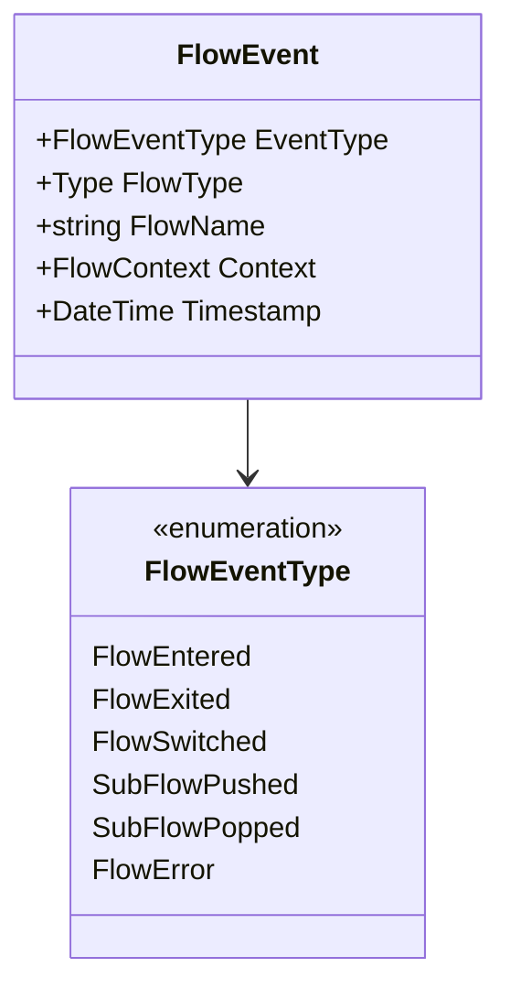
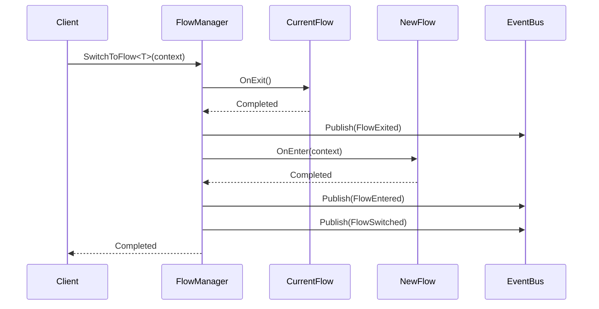
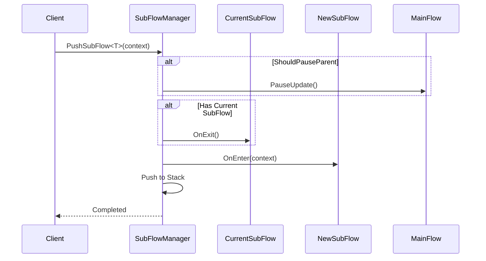
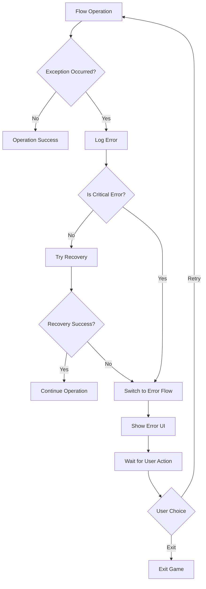
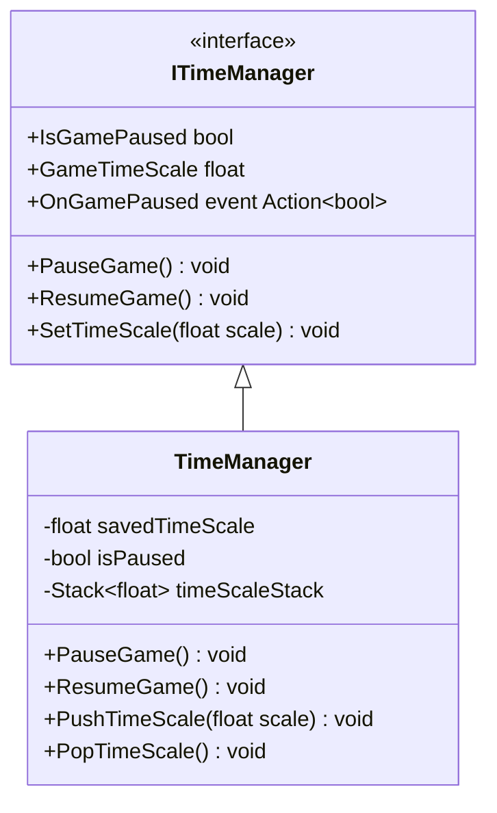
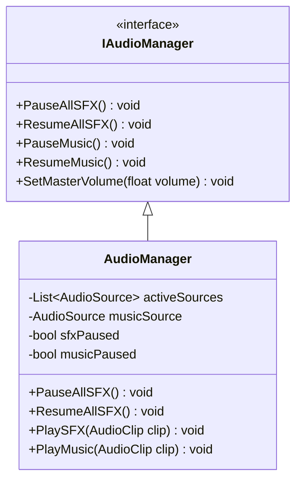

# Unity游戏框架通用流程系统设计文档

## 概述

本文档描述了VCGameFramework通用流程系统的详细设计，该系统提供了一个灵活、可扩展的游戏状态管理解决方案，支持主流程和子流程的嵌套管理。

## 架构设计

### 整体架构图



## 核心组件设计

### 1. 流程接口设计

#### IFlow - 基础流程接口
```csharp
public interface IFlow
{
    string FlowName { get; }
    UniTask OnEnter(FlowContext context = null);
    UniTask OnUpdate();
    UniTask OnExit();
    bool IsActive { get; }
}
```

#### IMainFlow - 主流程接口
```csharp
public interface IMainFlow : IFlow
{
    int Priority { get; }
    bool CanSwitchTo(Type targetFlowType);
}
```

#### ISubFlow - 子流程接口
```csharp
public interface ISubFlow : IFlow
{
    IMainFlow ParentFlow { get; set; }
    bool ShouldPauseParent { get; }
}
```

### 2. 流程管理器设计

#### FlowManager - 主流程管理器



#### SubFlowManager - 子流程管理器



### 3. 数据传递设计

#### FlowContext - 流程上下文



### 4. 事件系统设计

#### 流程事件定义



## 关键流程设计

### 1. 主流程切换流程



### 2. 子流程管理流程



### 3. 错误处理流程



## 具体流程设计

### 1. 主流程实现

#### LaunchFlow - 启动流程
```csharp
public class LaunchFlow : IMainFlow
{
    public string FlowName => "Launch";
    public int Priority => 0;
    
    private readonly ITimeManager timeManager;
    private readonly ILogService logService;
    
    public async UniTask OnEnter(FlowContext context)
    {
        logService.Info("Game launching...");
        
        // 初始化最小必备系统
        await InitializeCoreSystem();
        await LoadEssentialResources();
        
        // 自动切换到热更新流程
        var flowManager = context.GetTyped<FlowManager>();
        await flowManager.SwitchToFlow<HotUpdateFlow>();
    }
}
```

#### GameMainFlow - 游戏主流程
```csharp
public class GameMainFlow : IMainFlow
{
    public string FlowName => "GameMain";
    public int Priority => 100;
    
    private readonly SubFlowManager subFlowManager;
    private readonly IInputManager inputManager;
    
    public async UniTask OnEnter(FlowContext context)
    {
        // 初始化游戏系统
        await InitializeGameSystems();
        
        // 启动游戏进行中子流程
        await subFlowManager.PushSubFlow<GamePlaySubFlow>();
        
        // 监听输入事件
        inputManager.OnPausePressed += OnPausePressed;
    }
    
    private async void OnPausePressed()
    {
        await subFlowManager.PushSubFlow<PauseMenuSubFlow>();
    }
}
```

### 2. 子流程实现

#### PauseMenuSubFlow - 暂停菜单子流程
```csharp
public class PauseMenuSubFlow : ISubFlow
{
    public string FlowName => "PauseMenu";
    public IMainFlow ParentFlow { get; set; }
    public bool ShouldPauseParent => true;
    
    private readonly ITimeManager timeManager;
    private readonly IAudioManager audioManager;
    private readonly IUIManager uiManager;
    
    public async UniTask OnEnter(FlowContext context)
    {
        // 暂停游戏
        timeManager.PauseGame();
        audioManager.PauseAllSFX();
        
        // 显示暂停UI
        await uiManager.ShowUIAsync<PauseMenuUI>();
    }
    
    public async UniTask OnExit()
    {
        // 恢复游戏
        timeManager.ResumeGame();
        audioManager.ResumeAllSFX();
        
        // 隐藏暂停UI
        await uiManager.HideUIAsync<PauseMenuUI>();
    }
}
```

## 管理器设计

### 1. TimeManager - 时间管理器



### 2. AudioManager - 音频管理器



## VContainer集成设计

### 模块注册设计

```csharp
public class FlowSystemModule : IModule
{
    public void Configure(IContainerBuilder builder)
    {
        // 注册核心组件
        builder.Register<FlowManager>(Lifetime.Singleton);
        builder.Register<SubFlowManager>(Lifetime.Singleton);
        builder.Register<FlowContext>(Lifetime.Transient);
        
        // 注册管理器
        builder.Register<ITimeManager, TimeManager>(Lifetime.Singleton);
        builder.Register<IAudioManager, AudioManager>(Lifetime.Singleton);
        builder.Register<IInputManager, InputManager>(Lifetime.Singleton);
        
        // 注册主流程
        builder.Register<LaunchFlow>(Lifetime.Singleton);
        builder.Register<HotUpdateFlow>(Lifetime.Singleton);
        builder.Register<LoginFlow>(Lifetime.Singleton);
        builder.Register<GameMainFlow>(Lifetime.Singleton);
        
        // 注册子流程
        builder.Register<GamePlaySubFlow>(Lifetime.Singleton);
        builder.Register<PauseMenuSubFlow>(Lifetime.Singleton);
        builder.Register<SettingsSubFlow>(Lifetime.Singleton);
        builder.Register<InventorySubFlow>(Lifetime.Singleton);
        
        // 注册初始化入口点
        builder.RegisterEntryPoint<FlowSystemInitializer>(Lifetime.Singleton);
    }
}
```

## 性能考虑

### 1. 内存管理
- 使用对象池管理FlowContext实例
- 及时释放不再使用的流程资源
- 避免在流程中创建大量临时对象

### 2. 异步优化
- 使用UniTask避免不必要的协程开销
- 合理使用CancellationToken支持操作取消
- 避免在Update循环中进行复杂计算

### 3. 事件系统优化
- 使用MessagePipe的高性能消息传递
- 避免事件处理中的阻塞操作
- 及时取消不再需要的事件订阅

## 调试和监控

### 1. 编辑器工具
- 流程状态实时显示窗口
- 流程切换历史记录
- 性能监控和分析工具

### 2. 日志系统
- 详细的流程切换日志
- 错误和异常信息记录
- 性能指标采集

### 3. 运行时监控
- 流程执行时间统计
- 内存使用情况监控
- 事件处理频率分析

## 扩展性设计

### 1. 新流程添加
- 实现对应的流程接口
- 在模块中注册流程类
- 配置流程切换规则

### 2. 自定义管理器
- 实现标准的管理器接口
- 在模块中注册管理器
- 在流程中注入使用

### 3. 事件扩展
- 定义新的事件类型
- 实现事件处理逻辑
- 注册事件监听器