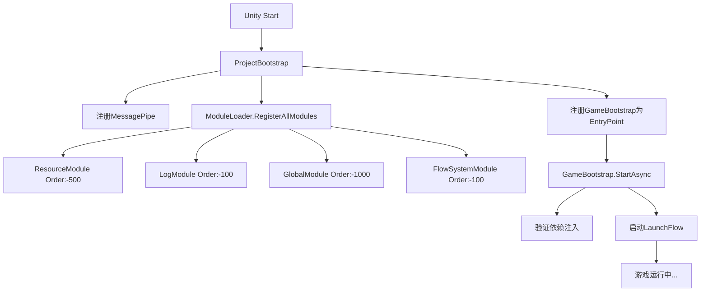

# 游戏启动系统 Bootstrap 📚

## 🎯 系统概述

Bootstrap系统负责整个游戏的启动流程，包括依赖注入配置、模块加载和流程系统初始化。

### 核心组件

```
Infrastructure/Bootstrap/
├── ProjectBootstrap.cs     # 主启动引导类（LifetimeScope）
├── GameBootstrap.cs        # 游戏启动管理器（EntryPoint）
└── README.md              # 本文档
```

## 🏗️ 架构设计

### 启动流程图



### 依赖注入层次

```
ProjectBootstrap (Root LifetimeScope)
├── MessagePipe (全局消息总线)
├── ModuleLoader (自动模块发现)
│   ├── ResourceModule (基础设施 Order:-500)
│   ├── LogModule (日志系统 Order:-100) 
│   ├── GlobalModule (全局服务 Order:-1000)
│   └── FlowSystemModule (流程系统 Order:-100)
└── GameBootstrap (游戏启动管理器 EntryPoint)
```

## 📋 组件详解

### 1. ProjectBootstrap.cs

**职责**: Unity根级LifetimeScope，负责整个DI容器的配置

**核心功能**:
- ✅ 注册MessagePipe全局消息总线
- ✅ 自动发现和注册所有模块（通过ModuleLoader）
- ✅ 注册GameBootstrap作为启动入口点

**优化完成**:
```csharp
protected override void Configure(IContainerBuilder builder)
{
    // 注册 MessagePipe 全局消息总线
    builder.RegisterMessagePipe();
    
    // 自动发现所有模块（优先级排序）
    ModuleLoader.RegisterAllModules(builder);
    
    // 注册游戏启动管理器
    builder.RegisterEntryPoint<GameBootstrap>();
}
```

### 2. GameBootstrap.cs ⭐ **已完善**

**职责**: 游戏启动管理器，负责游戏的实际启动流程

**新增功能**:
- ✅ **完整的错误处理**: 启动失败时的清理和错误对话框
- ✅ **依赖验证**: 确保关键服务正确注入
- ✅ **状态管理**: 防止重复启动和销毁后启动
- ✅ **资源清理**: 实现IDisposable接口，确保资源正确释放
- ✅ **取消支持**: 支持CancellationToken取消启动
- ✅ **日志集成**: 使用LogService替代Debug.Log

**启动流程**:
```csharp
public async UniTask StartAsync(CancellationToken cancellation = default)
{
    // 1. 状态检查（防重复启动、销毁检查）
    // 2. 取消令牌检查
    // 3. 依赖验证（FlowManager、LogService）
    // 4. 启动LaunchFlow（带启动上下文）
    //    注意：FlowManager构造后即可用，无需异步初始化
    // 5. 错误处理和资源清理
}
```

## 🎯 关键改进

### 1. 错误处理机制 🛡️

**之前**: 简单的try-catch和Debug.Log
```csharp
// ❌ 原始实现
catch (System.Exception ex)
{
    Debug.LogError($"流程系统启动失败: {ex.Message}");
}
```

**现在**: 完整的错误处理流程
```csharp
// ✅ 完善的错误处理
catch (System.Exception ex)
{
    _logService.Error($"游戏启动失败: {ex}");
    await HandleStartupError(ex);  // 清理资源、显示错误对话框
    throw;
}
```

### 2. 依赖验证 🔍

**新增功能**: 启动前验证所有关键依赖
```csharp
private async UniTask ValidateDependencies()
{
    // 验证FlowManager注入
    if (_flowManager == null)
        throw new InvalidOperationException("FlowManager 未正确注入");
    
    // 验证LogService注入
    if (_logService == null)
        throw new InvalidOperationException("LogService 未正确注入");
    
    // FlowManager设计为构造后即可用，无需异步初始化
    _logService.Info("✓ 依赖验证完成 - FlowManager构造后即可用");
}
```

### 3. 资源管理 ♻️

**实现IDisposable**: 确保资源正确释放
```csharp
public void Dispose()
{
    if (_disposed) return;
    
    try
    {
        _logService?.Info("GameBootstrap 开始清理资源...");
        _flowManager?.Dispose();
        _disposed = true;
    }
    catch (Exception ex)
    {
        Debug.LogError($"清理资源时发生错误: {ex.Message}");
    }
}
```

### 4. 启动上下文 📝

**传递启动信息**给LaunchFlow:
```csharp
var launchContext = FlowContextBuilder.Create()
    .WithData("FromBootstrap", true)
    .WithData("StartTime", System.DateTime.Now)
    .Build();
    
await _flowManager.SwitchToFlow<LaunchFlow>(launchContext);
```

## 🚀 使用示例

### 基本配置
```csharp
// 1. 在Unity场景中创建GameObject
// 2. 挂载ProjectBootstrap脚本
// 3. 确保该GameObject在场景加载时激活
// 4. 系统将自动启动游戏流程
```

### 扩展启动逻辑
```csharp
public class CustomGameBootstrap : GameBootstrap
{
    protected override async UniTask ValidateDependencies()
    {
        await base.ValidateDependencies();
        
        // 添加自定义验证逻辑
        await ValidateCustomServices();
    }
    
    private async UniTask ValidateCustomServices()
    {
        // 验证自定义服务
    }
}
```

## ⚡ 性能优化

### 模块加载优化
- **自动发现**: 无需手动注册模块，减少维护成本
- **优先级排序**: 确保基础设施服务优先初始化
- **异步初始化**: 支持复杂模块的异步初始化

### 启动时序保证
```
Order优先级 (数值越小越先执行):
-1000: GlobalModule     (全局基础服务)
-500:  ResourceModule   (资源系统)
-100:  FlowSystemModule (流程系统)
-100:  LogModule        (日志系统)
0:     其他业务模块
```

## 🔧 故障排除

### 常见问题

#### 1. GameBootstrap未启动
**症状**: 游戏没有进入LaunchFlow
**检查项**:
- ProjectBootstrap是否正确挂载到场景GameObject
- RegisterEntryPoint<GameBootstrap>()是否被调用
- 控制台是否有依赖注入错误

#### 2. 模块注入失败
**症状**: ValidateDependencies()抛出异常
**解决方案**:
```csharp
// 检查模块是否被正确发现
var modules = ModuleLoader.DiscoverModules();
foreach (var module in modules)
{
    Debug.Log($"发现模块: {module.GetType().Name}");
}
```

#### 3. FlowManager初始化失败
**症状**: FlowManager.InitializeAsync()抛出异常
**检查项**:
- FlowSystemModule是否正确注册
- Flow类是否正确实现接口
- 是否有循环依赖

## 📈 未来扩展

### 计划改进
1. **启动进度显示**: 在启动过程中显示加载进度
2. **配置系统集成**: 支持启动参数配置
3. **性能监控**: 记录启动耗时和性能数据
4. **A/B测试支持**: 根据配置启动不同的流程

### 扩展点
```csharp
// 1. 自定义启动验证
protected virtual async UniTask ValidateCustomDependencies() { }

// 2. 自定义错误处理
protected virtual async UniTask HandleCustomStartupError(Exception ex) { }

// 3. 自定义启动上下文
protected virtual FlowContext CreateLaunchContext() { }
```

## 🎉 总结

Bootstrap系统现在提供了：

✅ **完整的错误处理和恢复机制**  
✅ **自动模块发现和优先级管理**  
✅ **依赖验证和状态管理**  
✅ **资源清理和生命周期管理**  
✅ **详细的日志记录和调试信息**  

这个系统为整个游戏框架提供了稳定可靠的启动基础，确保所有模块按正确顺序初始化，并在出现问题时能够优雅地处理错误！🚀