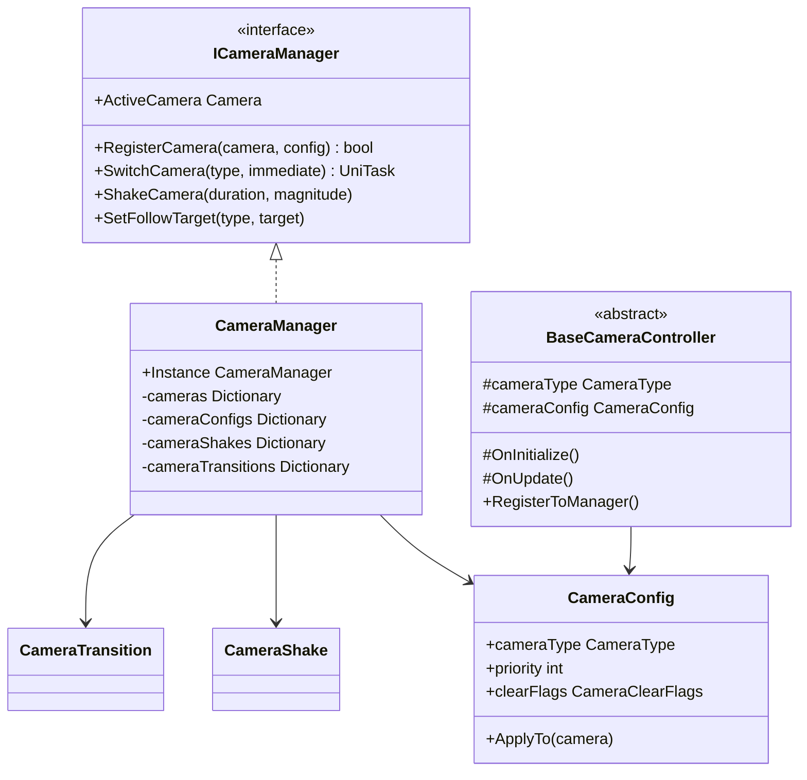

# 摄像机管理系统

Unity游戏框架的摄像机管理系统，提供完整的摄像机管理、切换、效果和控制功能。

## 🎯 主要功能

### 核心功能
- **多摄像机管理**: 支持同时管理多个不同类型的摄像机
- **摄像机切换**: 支持平滑过渡和瞬间切换
- **摄像机控制器**: 提供不同类型摄像机的专用控制器
- **震动效果**: 支持多种震动效果和自定义参数
- **过渡动画**: 支持位置、旋转、FOV等属性的平滑过渡
- **跟随功能**: 摄像机可以平滑跟随指定目标
- **UI集成**: 与UISystem无缝集成，自动管理UI摄像机

### 摄像机类型
- **Main**: 主摄像机，用于渲染游戏世界
- **UI**: UI摄像机，专门用于渲染UI界面
- **Effect**: 特效摄像机，用于渲染特殊效果
- **Minimap**: 小地图摄像机，用于渲染小地图
- **Cinematic**: 过场动画摄像机，用于播放过场演出

## 🏗️ 架构设计

### 目录结构
```
Assets/Game/Infrastructure/Camera/
├── Core/                           # 核心组件
│   ├── ICameraManager.cs          # 摄像机管理器接口
│   ├── CameraManager.cs           # 摄像机管理器实现
│   ├── CameraType.cs              # 摄像机类型枚举
│   └── CameraConfig.cs            # 摄像机配置类
├── Controllers/                    # 摄像机控制器
│   ├── BaseCameraController.cs    # 控制器基类
│   ├── MainCameraController.cs    # 主摄像机控制器
│   ├── UICameraController.cs      # UI摄像机控制器
│   └── EffectCameraController.cs  # 特效摄像机控制器
├── Effects/                        # 摄像机效果
│   ├── CameraShake.cs             # 摄像机震动效果
│   └── CameraTransition.cs       # 摄像机过渡效果
├── Module/                         # 模块化支持
│   └── CameraModule.cs            # VContainer模块
├── Examples/                       # 使用示例
│   └── CameraUsageExample.cs     # 完整使用示例
└── README.md                      # 文档说明
```

### 核心类图


## 🚀 快速开始

### 1. 模块注册
在项目中注册CameraModule：

```csharp
// 在LifetimeScope中注册
public override void Configure(IContainerBuilder builder)
{
    builder.RegisterModule<CameraModule>();
}
```

### 2. 基本使用

```csharp
public class GameController : MonoBehaviour
{
    [Inject] private ICameraManager cameraManager;
    
    private async void Start()
    {
        // 创建特效摄像机
        var effectConfig = new CameraConfig(CameraType.Effect)
        {
            position = new Vector3(0, 10, -10),
            rotation = new Vector3(15, 0, 0)
        };
        
        var effectCamera = cameraManager.CreateCamera(effectConfig);
        
        // 切换摄像机
        await cameraManager.SwitchCamera(CameraType.Effect);
        
        // 摄像机震动
        cameraManager.ShakeCamera(1f, 0.5f, 15f);
        
        // 设置跟随目标
        cameraManager.SetFollowTarget(CameraType.Main, playerTransform);
    }
}
```

### 3. 使用摄像机控制器

```csharp
public class PlayerController : MonoBehaviour
{
    [Inject] private ICameraManager cameraManager;
    
    private void Start()
    {
        // 获取主摄像机控制器
        var mainCamera = cameraManager.GetCamera(CameraType.Main);
        var controller = mainCamera.GetComponent<MainCameraController>();
        
        if (controller != null)
        {
            // 设置跟随目标和偏移
            controller.SetFollowTarget(transform, new Vector3(0, 5, -10));
            
            // 启用鼠标控制
            controller.SetMouseLookEnabled(true);
            
            // 启用键盘移动
            controller.SetKeyboardMovementEnabled(true);
        }
    }
}
```

## 📚 详细功能

### 摄像机管理

#### 注册和创建摄像机
```csharp
// 注册现有摄像机
var config = new CameraConfig(CameraType.Main);
cameraManager.RegisterCamera(existingCamera, config);

// 创建新摄像机
var newCamera = cameraManager.CreateCamera(config, parentTransform);
```

#### 摄像机切换
```csharp
// 平滑切换
await cameraManager.SwitchCamera(CameraType.Effect, false);

// 瞬间切换
await cameraManager.SwitchCamera(CameraType.Main, true);

// 激活/停用特定摄像机
cameraManager.ActivateCamera(CameraType.UI);
cameraManager.DeactivateCamera(CameraType.Effect);
```

### 摄像机效果

#### 震动效果
```csharp
// 基本震动
cameraManager.ShakeCamera(duration: 1f, magnitude: 0.5f, roughness: 15f);

// 使用震动预设
var shakeParams = CameraShake.CreatePreset(ShakePreset.Explosion);
var shake = CameraShake.AddTo(cameraObject);
shake.StartShake(shakeParams);

// 停止震动
cameraManager.StopCameraShake();
```

#### 过渡效果
```csharp
// 位置和旋转过渡
var transition = CameraTransition.AddTo(cameraObject);
await transition.TransitionTo(targetPosition, targetRotation, duration: 2f);

// FOV过渡
await transition.TransitionFOV(targetFOV: 45f, duration: 1f);

// 带淡入淡出的过渡
await transition.TransitionWithFade(targetPosition, targetRotation, duration: 2f, Color.black);
```

### 跟随功能

#### 通过管理器设置
```csharp
// 设置跟随目标
cameraManager.SetFollowTarget(CameraType.Main, target, smoothTime: 0.5f);

// 移除跟随目标
cameraManager.RemoveFollowTarget(CameraType.Main);
```

#### 通过控制器设置
```csharp
var controller = camera.GetComponent<MainCameraController>();
controller.SetFollowTarget(target, offset: new Vector3(0, 5, -10));
```

### UI摄像机集成

UISystem会自动管理UI摄像机：

```csharp
// 获取UI摄像机
var uiCamera = uiSystem.GetUICamera();

// 切换UI渲染模式
uiSystem.SwitchUIRenderMode(RenderMode.ScreenSpaceCamera);

// 设置新的UI摄像机
uiSystem.SetUICamera(newUICamera);
```

## 🎮 摄像机控制器

### MainCameraController
主摄像机控制器，支持：
- 目标跟随
- 鼠标视角控制
- 键盘移动
- 移动边界限制
- 平滑过渡

```csharp
var controller = camera.GetComponent<MainCameraController>();

// 设置跟随目标
controller.SetFollowTarget(playerTransform, new Vector3(0, 5, -10));

// 启用鼠标控制
controller.SetMouseLookEnabled(true);

// 设置位置和旋转
controller.SetPositionAndRotation(position, rotation, smooth: true);
```

### UICameraController
UI摄像机控制器，专门用于UI渲染：
- 自动查找Canvas
- 正交投影优化
- UI层级管理
- 分辨率适配

```csharp
var controller = camera.GetComponent<UICameraController>();

// 设置目标Canvas
controller.SetTargetCanvas(canvas);

// 调整正交大小
controller.AdjustOrthographicSize();

// 设置UI距离
controller.SetUIDistance(100f);
```

### EffectCameraController
特效摄像机控制器，用于特效渲染：
- 渲染纹理支持
- 后处理效果
- 截图功能
- 特效层管理

```csharp
var controller = camera.GetComponent<EffectCameraController>();

// 设置渲染纹理
controller.SetRenderTexture(renderTexture);

// 启用后处理
controller.SetPostProcessingEnabled(true);

// 捕获截图
var screenshot = controller.CaptureScreenshot();
```

## ⚙️ 配置选项

### CameraConfig
摄像机配置类，支持所有Unity Camera属性：

```csharp
var config = new CameraConfig(CameraType.Main)
{
    // 基本设置
    priority = 0,
    isPersistent = false,
    
    // 渲染设置
    clearFlags = CameraClearFlags.Skybox,
    backgroundColor = Color.black,
    cullingMask = -1,
    
    // 投影设置
    orthographic = false,
    fieldOfView = 60f,
    nearClipPlane = 0.3f,
    farClipPlane = 1000f,
    
    // 视口设置
    viewportRect = new Rect(0, 0, 1, 1),
    depth = -1,
    
    // 位置设置
    position = Vector3.zero,
    rotation = Vector3.zero
};
```

## 🔧 扩展指南

### 自定义摄像机控制器

```csharp
public class CustomCameraController : BaseCameraController
{
    protected override void OnInitialize()
    {
        base.OnInitialize();
        cameraType = CameraType.Main;
        // 自定义初始化逻辑
    }
    
    protected override void OnUpdate()
    {
        // 自定义更新逻辑
    }
    
    protected override void OnActivate()
    {
        // 摄像机激活时的逻辑
    }
    
    protected override void OnDeactivate()
    {
        // 摄像机停用时的逻辑
    }
}
```

### 自定义摄像机类型

```csharp
// 扩展摄像机类型枚举
public enum CameraType
{
    Main = 0,
    UI = 100,
    Effect = 200,
    Minimap = 300,
    Cinematic = 400,
    Security = 500,     // 自定义：安全摄像机
    Spectator = 600     // 自定义：观察者摄像机
}
```

## 🐛 故障排除

### 常见问题

1. **摄像机管理器未初始化**
   - 确保已注册CameraModule
   - 检查VContainer配置是否正确

2. **UI摄像机不工作**
   - 确保UI层级设置正确
   - 检查Canvas的渲染模式设置

3. **摄像机切换不平滑**
   - 检查过渡时间设置
   - 确保目标摄像机位置正确

4. **震动效果不明显**
   - 调整震动参数（magnitude和roughness）
   - 检查摄像机是否被其他组件控制

### 调试技巧

1. **启用详细日志**：CameraManager会输出详细的操作日志
2. **使用CameraUsageExample**：参考完整的使用示例
3. **Inspector调试**：使用控制器的Inspector工具方法
4. **事件监听**：监听摄像机切换事件进行调试

```csharp
cameraManager.OnCameraSwitched += (oldType, newType) =>
{
    Debug.Log($"摄像机切换: {oldType} -> {newType}");
};
```

## 📋 性能建议

1. **避免频繁切换**：过于频繁的摄像机切换会影响性能
2. **合理设置渲染层**：使用cullingMask优化渲染
3. **及时清理**：不使用的摄像机及时销毁
4. **震动优化**：避免长时间的高频率震动
5. **过渡优化**：合理设置过渡时间，避免过于复杂的动画曲线

## 📄 许可证

本项目基于你的Unity游戏框架许可证。